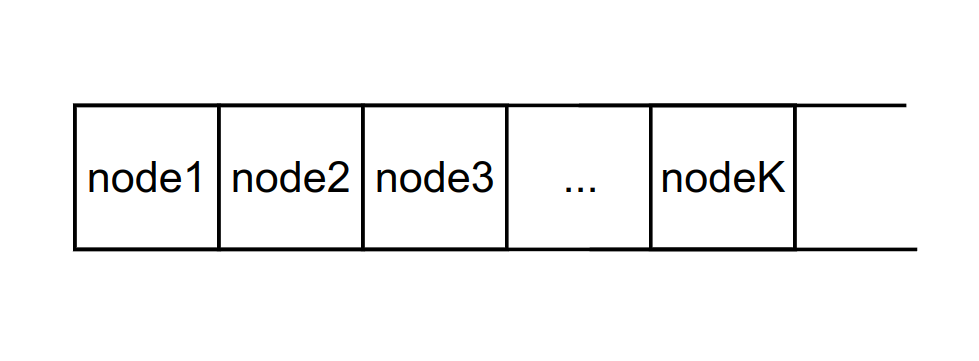
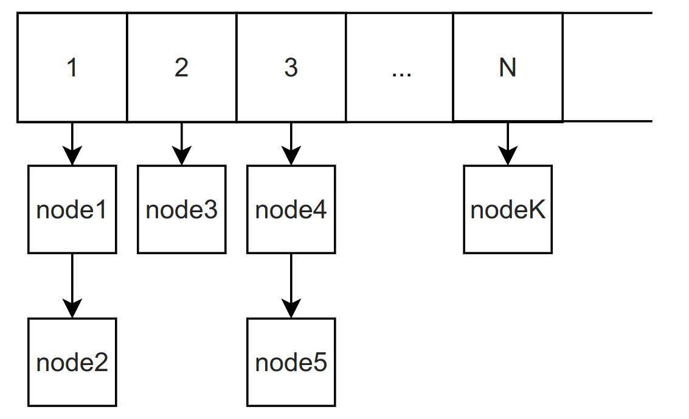

| Вариант | Номер  задачи | Структура  данных | Метод поиска | Метод сортировки | Метод корректировки |
| ------- | ---------------- | -------------------- | --------------- | ------------------- | ---------------------- |
| 10      | 2                | Таблица              | Дихотомический  | Слиянием            | Удаление маркировкой   |

Задача 2. Дана таблица материальных нормативов, состоящая из K записей фиксированной длины вида: код детали, код материала, единица измерения, номер цеха, норма расхода.

## Ориг

Таблица - одномерный дин массив

Предполагается, что удаление - редкая операция, тк нормативы не удаляются/изменяются

### Дихотомический

Ищем самое левое вхождение нужного ключа, дальше последовательно ищем элемент с нужной характеристикой
поиск logK+ M

Ввод за O(K) - для поддержания сортированного вида

сортировка - O(KlogK)

удаление O(1) - но память остается

таблица прямого доступа - дин массив списков

поиск  -- O(M)

Удаление --О(1)

сортировка  -- O(N\*MlogM)
